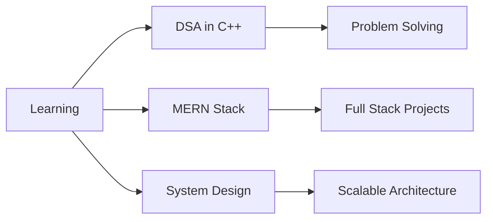

<div align="center">
  
</div>

<div align="center">
  
  
</div>

---

## 🚀 About Me

```javascript
const shahid = {
    pronouns: "He/Him",
    location: "Ghaziabad, India 🇮🇳",
    education: "B.Tech CSE @ ABES Engineering College",
    currentFocus: ["DSA in C++", "MERN Stack Development", "System Design"],
    goal 2025: "Land a Software Engineering Internship",
    hobbies: ["Competitive Programming", "Fitness", "Environmental Activities"]
};
```

🎓 **3rd Semester CSE Student** | 💡 **Problem Solver** | ⚡ **Fast Learner**

- 🔭 Currently building **production-ready web applications**
- 🌱 Learning **MERN Stack, System Design & Cloud Computing**
- 💻 Solved 70+ LeetCode problems & 250+ CodeChef problems | CodeChef Rating: 1198
- ☁️ **AWS Cloud Practitioner Certified**
- 🎯 **2025 Goal:** Master Full-Stack Development
- 💬 Ask me about **React, DSA, Competitive Programming**
- 📫 Reach me: **shahidansari945256@gmail.com**

---

## 🌐 Connect With Me

<div align="center">
  
[](https://linkedin.com/in/shahid-ansari-433449327)
[](https://github.com/shahidansari310)
[](https://leetcode.com/u/shahid310/)
[](https://www.codechef.com/users/shahid_310)
[](https://instagram.com/_shahid_129_)
[](https://x.com/Shahid__310)
[](mailto:shahidansari945256@gmail.com)

</div>

---

## 💻 Tech Stack

### Languages


### Frontend Development


### Backend Development


### Database


### Tools & Platforms


### Cloud & DevOps


---

## 🏆 Featured Projects

<div align="center">

### 📰 [NewsWave - News Aggregator](https://newsapp-by-shahid.vercel.app/)
[](https://github.com/shahidansari310/newsapp)
[](https://newsapp-by-shahid.vercel.app/)

Real-time news aggregator with Dark Mode, search functionality, and glassmorphism UI design
> **Tech:** React.js • News API • CSS3 • Responsive Design

---

### 🌦️ [Weather Application](https://weather-app-ivory-beta-96.vercel.app/)
[](https://github.com/shahidansari310/Weather-App)
[](https://weather-app-ivory-beta-96.vercel.app/)

Comprehensive weather app with real-time forecasts and location-based services
> **Tech:** React.js • OpenWeather API • Hooks • State Management

</div>

---

## 📊 GitHub Statistics

<div align="center">
  
</div>

<div align="center">
  
</div>

---

## 🏅 Achievements & Certifications

<div align="center">

| Certification | Issuer |
|--------------|--------|
| ☁️ AWS Cloud Practitioner | GeeksforGeeks |
| ⚛️ ReactJS Certification | GeeksforGeeks |
| 💻 C++ Programming: Beginner to Advanced | Udemy |
| 🗃️ SQL Bootcamp | Udemy |
| 🌐 Web Development | Udemy |
| 🔀 Git: Version Control Fundamentals | Udemy |

</div>

### 🎯 Competitive Programming
- 🏆 **250+ Problems** solved on CodeChef
- ⚡ **50 Days Badge** on LeetCode
- 📈 Active participant in coding contests

---

## 📈 Contribution Graph

<div align="center">
  
</div>

---

## 🎯 Current Focus



<div align="center">
  
### 💬 *"Code is like humor. When you have to explain it, it's bad."* – Cory House

**Thanks for visiting! Let's connect and build something amazing together! 🚀**

[](https://visitcount.itsvg.in)

</div>
