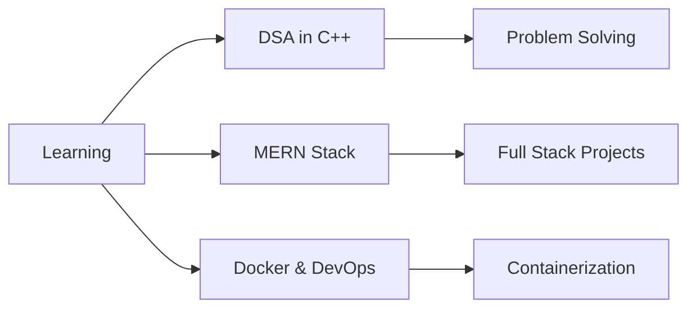

<div align="center">
  
</div>

<div align="center">
  
  
</div>

---

## 🚀 About Me

```javascript
const shahid = {
    role: "Full Stack Developer & Problem Solver",
    location: "Ghaziabad, India 🇮🇳",
    college: "ABES Engineering College | CSE 3rd Sem",
    currentlyLearning: ["Data Structures & Algorithms in C++", "MERN Stack", "Docker & DevOps"],
    certifications: ["AWS Cloud Practitioner", "ReactJS"],
    achievements: "250+ problems solved | CodeChef Rating: 1198",
    interests: ["Web Development", "Competitive Programming", "System Design"],
    lifePhilosophy: "Learn, Build, Repeat 🔄"
};
```

🔥 **Computer Science Student** passionate about building scalable web applications

- 🌟 Currently mastering **DSA in C++** and **Full-Stack Development**
- 🚀 Building real-world projects with **React.js & Node.js**
- 💻 Solved **70+ LeetCode problems** & **250+ CodeChef problems** | **CodeChef Rating: 1198**
- ☁️ **AWS Certified** Cloud Practitioner
- 🎯 **Mission 2025:** Secure a Software Engineering Internship
- 📚 Love exploring new technologies and frameworks
- ⚡ Fun fact: **Debugging is my cardio!** 💪

---

## 🌐 Connect With Me

<div align="center">
  
[](https://linkedin.com/in/shahid-ansari-433449327)
[](https://github.com/shahidansari310)
[](https://leetcode.com/u/shahid310/)
[](https://www.codechef.com/users/shahid_310)
[](https://instagram.com/_shahid_129_)
[](https://x.com/Shahid__310)
[](mailto:shahidansari945256@gmail.com)

</div>

---

## 💻 Tech Stack

### Languages


### Frontend Development


### Backend Development


### Database


### Tools & Platforms


### Cloud & DevOps


---

## 🏆 Featured Projects

<div align="center">

### 📰 [NewsWave - News Aggregator](https://newsapp-by-shahid.vercel.app/)
[](https://github.com/shahidansari310/newsapp)
[](https://newsapp-by-shahid.vercel.app/)

Real-time news aggregator with Dark Mode, search functionality, and glassmorphism UI design
> **Tech:** React.js • News API • CSS3 • Responsive Design

---

### 🌦️ [Weather Application](https://weather-app-ivory-beta-96.vercel.app/)
[](https://github.com/shahidansari310/Weather-App)
[](https://weather-app-ivory-beta-96.vercel.app/)

Comprehensive weather app with real-time forecasts and location-based services
> **Tech:** React.js • OpenWeather API • Hooks • State Management

</div>

---

## 📊 GitHub Statistics

<div align="center">
  
</div>

<div align="center">
  
</div>

---

## 🏅 Achievements & Certifications

<div align="center">

| Certification | Issuer |
|--------------|--------|
| ☁️ AWS Cloud Practitioner | GeeksforGeeks |
| ⚛️ ReactJS Certification | GeeksforGeeks |
| 💻 C++ Programming: Beginner to Advanced | Udemy |
| 🗃️ SQL Bootcamp | Udemy |
| 🌐 Web Development | Udemy |
| 🔀 Git: Version Control Fundamentals | Udemy |

</div>

### 🎯 Competitive Programming Stats
- 🔥 **250+ Problems** solved on CodeChef | **Rating: 1198** ⭐
- 🏅 **70+ Problems** solved on LeetCode | **50 Days Badge** earned
- 📊 Consistent daily problem-solving practice
- 💪 Focus on DSA, algorithms, and optimization

---

## 🎯 Current Focus



---

## 🐍 Contribution Snake

<div align="center">
  
</div>

---

<div align="center">
  
### 💭 *"First, solve the problem. Then, write the code."* – John Johnson

**Thanks for stopping by! Let's connect and create something awesome together! 🚀✨**

[](https://visitcount.itsvg.in)

</div>
